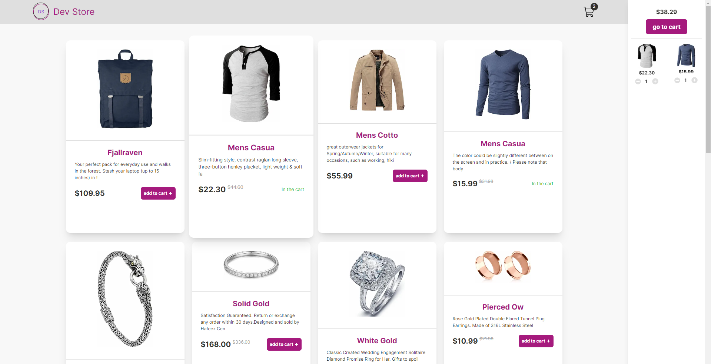

# Dev Store

#### Acesse o projeto aqui -> [Dev Store](https://desafio-tecer.vercel.app/)

 

# 📋 Sobre

A Dev Store é uma aplicação web de e-commerce desenvolvida para fornecer uma experiência de compra simples e intuitiva. A aplicação permite que os usuários naveguem por uma seleção de produtos e adicionem itens ao carrinho de compras para facilitar o processo de compra.

 

# 🛠 Tecnologias Usadas

   

 

# 🔮 Funcionalidades:

✅ Requisição de API

✅ Carrinho de Compras

✅ Catálogo de Produtos

✅ Página de Produto

✅ Design e Usabilidade

✅ Responsividade

 

 

# 🔧 Entendendo decisões arquiteturais e a estrutura do projeto

### Setup de ambiente:

- [Node](https://nodejs.org/en)

### Como rodar na minha máquina?

- Clone o projeto `git clone https://github.com/matheusleite01/DesafioTecer.git`
- Rode `npm install`
- Rode `npm run dev`
- Pronto 🎉

### Estrutura do projeto

- `/__tests__`: Contém os arquivos de testes unitários para verificar o funcionamento correto do código da aplicação.
- `/src/assets`: Contém os arquivos estáticos, como imagens, fontes, ícones e outros recursos.
- `./src/pages`: É a pasta que o Next.js usa para definir as rotas da aplicação
- `./src/components`: São todos os pedaços primordiais de interface como componentes
- `./src/context`: Pasta utilizada para armazenar arquivos relacionados ao contexto de aplicação
- `./src/service`: Pasta utilizada para armazenar a lógica de serviço ou camada de comunicação com APIs e outras fontes de dados.
- `./src/hooks`: Pasta para armazenar todos os custom hooks
- `./src/types`: Pasta para organizar definições de tipos e interfaces TypeScript
- `./src/style`: Estilos globais do projeto
- `./src/utils`: Pasta utilizada para armazenar funções utilitárias 

### Como me localizar no projeto?

- Todos os `componentes` que representam as páginas estão em `./src/components`
  - Uma vez dentro de uma página você pode ir navegando pelos componentes para ir se encontrando e fazer a alteração que deseja

# 📌 Teste 
Esta aplicação inclui uma suíte de testes para garantir a funcionalidade e a estabilidade do código. Os testes abrangem componentes, utilitários e fluxos principais da aplicação.

### Ferramentas Utilizadas

- `Jest`: Um framework de testes JavaScript que permite escrever testes de maneira simples e intuitiva.

- `React Testing Library`: Utilizada para testar componentes React, focando em interações do usuário.

### Como rodar na minha máquina?

- Rode `npm run test`
- Pronto 🎉